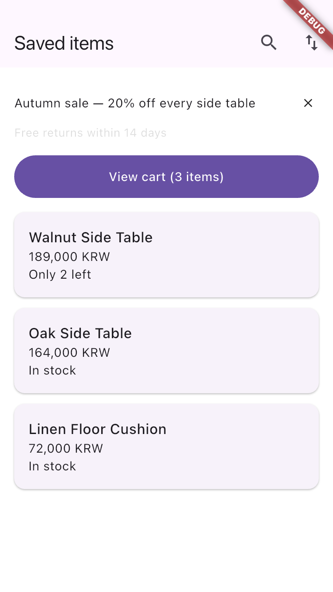
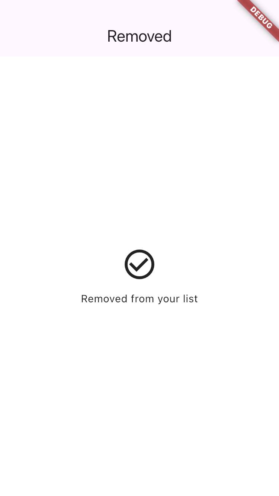

# flutter-ux-journey

A Claude Agent Skill that audits a **running** Flutter app one *user journey* at a time, and scores
what it finds against that journey's goal (severity 4/3/2/1/✓, defined in
[`heuristics.md`](skills/flutter-ux-journey/references/heuristics.md)).

**Why it exists.** I build Flutter apps for clients, and one of them asked for a UX review. The
Flutter tools I could find check components — is this button 44 px, does this image have a label.
The client was asking something else: how many steps does the task people come for take, and is
what matters most to them the thing the screen puts first? In the demo app below, the rank-1 task
is the 6th of 8 tap targets on the entry screen, with five unranked controls above it. No component
check can say that, because it is not a property of any one widget. So this audits the journey,
not the widget.

**The pitch: a Flutter UX audit that measures instead of guessing.** Every finding carries
evidence pulled out of a live app — real pixel `Rect`s, real contrast ratios, real semantics labels —
not a model's estimate of what a screenshot probably looks like. It is not the first tool to measure
a running Flutter app; it is the one that attaches those measurements to a journey and scores them
against its goal ([Prior art](#prior-art)).

That now extends past per-screen polish to the thing people actually mean by UX — **the flow**.
Where a control sits on the surface, whether the user can get back out of a screen, whether the tap
the walk just made changed anything at all, and whether the task you said the app is for is the
sixth thing on its own home screen. A worked example, produced by a real run rather than written by
hand: [`example/report.md`](example/report.md), with the raw walk data every number in it came out
of in [`example/walk.json`](example/walk.json) and, for a second run that walks past a sign-in gate
with no credentials, [`example/walk-gated.json`](example/walk-gated.json).

|  |  |
|---|---|
| **Step 1** — the entry screen. The promo `×` measures `Size(24.0, 24.0)` against a required 44; the grey line under it returns a contrast ratio of 1.03; and the journey's rank-1 task is the 6th of the 8 tap targets here. | **Step 3** — where removing an item lands the user. The walk records `canPop: false` and `tappableCount: 0`: nothing to tap, nothing on the stack. Not one per-screen check fires on this screen, because per screen there is nothing wrong with it. |

**No device needed** — the walk runs under `flutter test`, and you can see it on the bundled demo app
before pointing it at your own. Real devices are not verified; the full statement is under
[Platform support](#platform-support).

## Try it on the bundled demo app

You do not need a Flutter app of your own to see what this produces. `example/ux_demo_app` is a
backend-free `com.example.*` fixture with **six deliberately seeded defects**, and it ships with the
report those defects produce — the two screens above are from it.

```bash
git clone https://github.com/masanggil1986/flutter-ux-journey.git
cd flutter-ux-journey/example/ux_demo_app
flutter pub get
flutter test ux_audit/ux_journey_test.dart
```

No device, no device id. Cost on this machine: about **2 s** per run with the toolchain warm — the
simulator walk it replaces took about 70 s the first time and 20 s after, plus ~350 MB in `build/`.
A first run in a fresh clone still pays Flutter's usual compile.

**Steps 2 and 3 are supposed to fail.** That is the fixture working: step 2 asks for a way to back
out before the data is destroyed and there is none, step 3 asks to go back and the screen has no
back control. And the run **exits 0 either way** — the exit code is not the oracle. Read
`steps[].status` in `ux-audit-out/walk.json`.

What you get:

- `ux-audit-out/walk.json` — the walk data: per step a semantics dump, the four accessibility
  guideline results, viewport and surface measurements, timings, and a `conditions` block naming
  the mode, device profile, font source and rasterizer every number above was produced under.
- `ux-audit-out/screens/step_{1..4}.png` — one screenshot per step.

Compare what you get against [`example/report.md`](example/report.md) and
[`example/walk.json`](example/walk.json). Both come from the same journey walked on an iPhone SE
(3rd gen) simulator, so your headless run matches them on step outcomes, screen signatures,
guideline verdicts and tap-target rects, and differs where the device mattered: `conditions` (the
host platform, plus the mode, font source and rasterizer keys), the contrast ratio (1.36 headless
against 1.03), text rects by a few lpx, and the per-step timings. The fixture's six defects, and the two traps seeded for the
walker rather than for the report, are catalogued in
[`example/ux_demo_app/README.md`](example/ux_demo_app/README.md).

That run is the walk alone. The audit — static probe, walk, visual read, and the scored write-up —
is what the skill drives once it is installed; see [60 seconds to a report](#60-seconds-to-a-report).

## Who this is for

A Flutter developer, or their agent, on a machine that can already build and run the app. Everything
below assumes you can `flutter run` the thing you want audited.

The journey, though, is not the engineer's document. `## Steps` is what a user is trying to do and
`## Priorities` is what the app is for — both are product input, and the tool will not infer either.
The report is written to go back the other way: it opens with a verdict in plain words, and it reads
without its screenshots, so you can hand it to whoever asked for the feature.

## Install

As a Claude Code plugin — these two lines are typed at the Claude Code prompt, not in a shell:

```text
/plugin marketplace add masanggil1986/flutter-ux-journey
/plugin install flutter-ux-journey@flutter-ux-journey
```

To try it for one session without writing anything to your settings:

```bash
git clone https://github.com/masanggil1986/flutter-ux-journey.git
cd flutter-ux-journey
claude --plugin-dir .
```

For any other agent: keep the clone, and link or copy `skills/flutter-ux-journey/` into that
agent's skills directory. The skill reads from the clone itself — `tools/astprobe/` for the probe,
`example/ux_demo_app/` for the walker it copies — so `${CLAUDE_PLUGIN_ROOT}` in `SKILL.md` means
your clone root.

### Requirements

- **Flutter 3.47.2 / Dart 3.13.2 or newer.** That floor is the demo app's own
  (`example/ux_demo_app/pubspec.yaml` declares `sdk: ^3.13.2`); `tools/astprobe` alone needs Dart
  3.11 or newer, because its `package:analyzer` does. Dart ships with Flutter.
- Nothing else for the default mode. The walk runs under `flutter test`.
- **Only for the `flutter drive` fallback** — an app whose plugins or platform views need a real
  device under them: **Xcode** for iOS simulators or the **Android SDK** for emulators, a **booted**
  one, and its device id:

  ```bash
  open -a Simulator && flutter devices                           # iOS
  flutter emulators --launch <emulator-id> && flutter devices    # Android
  ```

- The shell snippets in this README assume **bash or zsh**.

Nothing from pub.dev is needed on the host except for the static probe: a single
`dart pub get` in `tools/astprobe` resolves `package:analyzer` plus `package:test` for that probe's
own unit test — 47 packages with transitives (`tools/astprobe/pubspec.lock`), none of them loaded
into the app under audit. What *does* land in the audited app is spelled out under
[What the run puts in your repo](#what-the-run-puts-in-your-repo).

## 60 seconds to a report

1. Write a `journey.md` next to your app. A goal line and numbered steps, each with what should happen:

   ```markdown
   # Goal
   A first-time user completes checkout without leaving the app.
   Done = a confirmation screen names the order.

   ## Setup (excluded from measurement and scoring)
   1. tap "Skip" — expect "Shop"

   ## Device (optional)
   `iphone-se`
   - textScale 3.0

   ## Steps
   1. tap "Shop" — expect the product list
   2. scroll until "Walnut Side Table" — expect "Walnut Side Table"
   3. tap "Walnut Side Table" — expect a price and "Add to cart"
   4. tap "Add to cart" — expect the cart badge to read 1
   5. tap "Checkout" — expect the payment form
   6. tap "Pay" — expect a confirmation naming the order

   ## Priorities (optional)
   1. buy something
   2. check an order's status
   ```

   The five headings are the format, not decoration: `## Steps` is what the walker is generated
   from, `## Setup` is what keeps an onboarding sheet or a sign-in gate out of your score, and
   `## Device` is the screen and the conditions (text scale, dark, locale, bold text) the walk is
   measured under. An OS permission dialog cannot be a setup step: headless there is no OS to show
   one, and on a device it is outside the semantics tree the walk reads. Pick each `expect` so it is
   not already on the screen the step starts from — a step whose expectation was already there is
   reported as not proven. Full spec in
   [`SKILL.md`](skills/flutter-ux-journey/SKILL.md); a real one in
   [`example/journey.md`](example/journey.md).

   `## Priorities` is the only thing that makes "this is buried" sayable, and it is never inferred.
   Leave it out and the report says so instead of guessing.

2. Ask Claude: **"audit journey.md against this app"**. No device needed — boot a simulator only
   if the audit tells you the app needs the `flutter drive` fallback (see [Requirements](#requirements)).
3. Read `report.md`. Each finding names its evidence layer (`STATIC` / `RUNTIME` / `VISUAL` /
   `JOURNEY`), its measured numbers, and a severity scored against *your* goal — the same defect is a
   4 when it blocks the goal and a 2 when there is a way around it.

**If the app starts behind a sign-in screen, the audit still never asks you for a credential.** The
walk runs inside the app's own process, so it stubs the `dart:io` `HttpClient` there instead
([`references/network-stub.md`](skills/flutter-ux-journey/references/network-stub.md)) and declares
the gate as `## Setup`, which is excluded from measurement and scoring. The stub, like the default
network cut, covers that client and nothing else: before walking, the audit checks your
`pubspec.yaml` and code for WebSockets, sockets, background isolates and native HTTP clients, and
tells you if any of them could still reach your backend. The worked instance is
[`example/journey-gated.md`](example/journey-gated.md): three setup steps, arbitrary values, and
`networkCalls: ["/session", "/auth/login"]` in
[`example/walk-gated.json`](example/walk-gated.json) — no account involved.

### What the run puts in your repo

The skill generates `ux_audit/ux_journey_test.dart` into the app being audited — one file, plus a
network stub beside it if the journey has a gate to walk past — writes its output under
`ux-audit-out/`, and tells you to add those paths to that app's `.gitignore`. The `flutter drive`
fallback adds two more, `integration_test/ux_journey_drive.dart` and
`test_driver/ux_journey_driver.dart` — its own name, so it never touches the
`test_driver/integration_test.dart` your app may already have.

`ux_audit/` rather than `integration_test/` for two reasons, both measured: `flutter test` routes
anything under `integration_test/` to a device runner on the directory name alone, and anything
under `test/` would be swept into your own suite by a bare `flutter test`.

One thing cannot be gitignored: the run **edits your `pubspec.yaml`** to add `flutter_test` as a
`dev_dependency` — and `integration_test` too, but only if you need the fallback. That is one or two
entries, and reverting it is deleting them.

Adding `integration_test` also pulls Flutter's own test closure into your lockfile. Verified against
[`example/ux_demo_app/pubspec.lock`](example/ux_demo_app/pubspec.lock), that is
`flutter_driver`, `fuchsia_remote_debug_protocol` and `integration_test` from the SDK, plus six
hosted packages — `file`, `platform`, `process`, `sync_http`, `web`, `webdriver`. None of them is a
choice this project made: they are Flutter's test dependency, they are dev-only, and they are the
same ones any `integration_test` in any Flutter app resolves. **No third-party package of ours goes
into your app at all.**

## How it works

```
journey.md
  └─ 0a. feature map  the app's declared routes, where the probe can read them, and which this journey covers
     0. preflight     confirm the parsed goal + steps before running anything
     1. static        package:analyzer over the source — missing labels, unlabeled tap handlers
     2. walk          a generated test, run with `flutter test` (`flutter drive` as fallback)
     3. visual        the model reads the screenshots the walk captured
     4. merge         findings deduped, scored 4/3/2/1/✓ against the goal, written up
```

Stage 0a is not optional and it is not a crawl: it reads the declared routes, which is the app's own
statement of its feature surface, and it is what stops a score over one journey from reading like a
score over the app. Routes the walk never reached are reported as **not audited**.

Steps 3 and 4 are the model following written heuristics, not scripts. Scoring a tap target as fatal
*here* and tolerable *there* depends on the journey's goal; that is judgement, and a script doing it
would only be judgement in a costume.

The walk runs **inside** the app's own test process rather than steering it from outside. That is not
a style choice: structured semantics (label / value / tooltip / role / flags / actions / rect) and
Flutter's four built-in accessibility guidelines are reachable only from in-process. Over the VM
service you get a prose dump and none of the geometry. Details and receipts in
[`docs/day1/native-runtime.md`](docs/day1/native-runtime.md).

## What it actually measures

Sizes and positions below are in **lpx** — logical pixels, the unit Flutter's `Rect`s use. Semantics
rects come out of the tree in physical pixels, so the walk divides by `devicePixelRatio`: 44 lpx is
44 lpx at any screen density.

Flutter ships four ready-made accessibility guidelines in `package:flutter_test` (it also has
configurable contrast classes, `MinimumTextContrastGuidelineAAA` and
`CustomMinimumContrastGuideline`, which this walk does not run). All four were run on a real
simulator and headless, with identical verdicts, and return a node, a pixel `Rect`, the measured
value and the required value:

| guideline | what it returns |
|---|---|
| `iOSTapTargetGuideline` / `androidTapTargetGuideline` | `expected tap target size of at least Size(44.0, 44.0), but found Size(24.0, 24.0)` + the node's `Rect` |
| `labeledTapTargetGuideline` | every tappable node with no semantic label |
| `textContrastGuideline` | `Expected contrast ratio of at least 4.5 but found 3.68 for a font size of 14.0` — computed from real rendered pixels |

Plus, per step: the full semantics tree as JSON, a PNG screenshot, and wall-clock timing — and,
for the flow half of the report, measurements the guidelines do not provide:

| measured | what it answers |
|---|---|
| `viewport` — `foldY`, `contentTop`, `keyboardInset` | what is on screen without scrolling. `physicalSize` alone is the whole display, so system padding and the keyboard inset are subtracted; in a plain `flutter test` it is Flutter's hardcoded 800×600 and the report blanks the column rather than quoting a fold for a phone that does not exist. Headless, a keyboard has no height, so while one is up the fold is recorded as unknown rather than guessed |
| `effectivePct` / `centreCovered` per tap target | whether a control that passes every size check is actually hittable. A 48 lpx CTA under a banner keeps a 16 lpx strip — and its own rect still reads 48 lpx |
| `canPop` / `tappableCount` / `modalOpen` per step | `DEAD-END` as a measurement rather than a guessed label that failed to match |
| `dispatched` / `semanticsUnchanged` / screen signature | dead taps, revisits, state lost on the way back. The signature reads checked/selected/toggled state, so a working checkbox is a change |
| `expectedBefore` / `centreHitsHandler` per step | whether the step's expectation was already on screen before it acted — then its `OK` is reported as not proven — and whether a tap reached a handler at all |
| `onScreen` / `coversSurface` per node | what is really on the surface. A scrollable builds rows past the viewport into the dump; a full-screen keyboard-dismiss `GestureDetector` is always first and always largest. Counting either wrecks every placement number |
| `tapsSoFar` | reach cost **on the declared path** — never a minimum, because a minimum needs paths nobody declared |

### Placement, without guessing what matters

"This feature is important but buried" needs two halves, and only one of them is measurable.
Feature importance is in no artifact — not the source, not the semantics tree, not the router — so
the tool never ranks anything. It compares two **declarations**: an optional `## Priorities` block
in `journey.md` (what the app is for, from the person who knows) against the entry screen's tap
targets in reading order, with their rects and fold position (what the app actually promotes). The
finding is the disagreement, and it reads like one:

> The entry screen carries 8 tap targets and this journey traverses 1. Your rank-1 task is the 6th
> of those 8, at y=239 lpx. Five controls sit above it, and none of the five appears in any
> declared priority.

Declare nothing and the report says `not declared` and caps the affected findings — it does not
infer a ranking from tab order, label size or route depth. And "N taps deep" never carries a
severity on its own: the 3-click rule is disproved (Porter 2003; NN/g measured no increase in
dropoff past three clicks), so depth is paired with a declared priority or an observed backtrack,
or it is printed as an observation.

## Platform support

> **No device needed by default; a simulator or emulator is the fallback.**
> The default walk runs under `flutter test` and is checked in this repo's own suite against the
> simulator run committed as [`example/walk.json`](example/walk.json) — same step outcomes, same
> screen signatures, same sixteen guideline verdicts, same semantics node counts, same viewport
> ([`widget_walk_test.dart`](example/ux_demo_app/test/widget_walk_test.dart)).
> **Two things it cannot borrow from a device, and records instead of hiding.** Text metrics come
> from the app's own fonts when it declares any and from the SDK's Roboto otherwise; with the
> stand-in, placement is close but not the app's own. And contrast ratios come from a software
> rasterizer that differs from a device's by a small margin — measured on the same node, 1.36
> headless against 1.03 on the simulator, same verdict — so a ratio near the threshold is advisory.
> Both land in `conditions` (`fontSource`, `renderer`) and the report's scope clause quotes them.
> **The fallback is `flutter drive` on a booted simulator or emulator**, for an app whose plugins
> throw `MissingPluginException` or whose platform views have to actually render. That pipeline was
> built and run end to end on an iOS simulator (iPhone SE, iOS 18.6), an iPad Pro 13" simulator, and
> an Android emulator (API 36), all on Flutter 3.47.2 stable. There, screenshots are iOS-only:
> `takeScreenshot` deadlocks on Android — no error, no timeout — when the app embeds platform views,
> and from inside the test there is no way to tell in advance. The visual layer is captured from the
> host instead (`adb exec-out screencap` / `xcrun simctl io`), or reported as not assessable.
> The newer step lines — `scroll until`, `long-press`, `system back`, `expect no` — are verified
> headless and under `flutter drive` on an Android emulator (API 36), not yet on iOS. The
> `## Device` conditions apply headless only: under `flutter drive` the device's own settings are
> what the walk measures and records, so set those on the device instead.
> **Real devices are not verified and are not claimed.**

## What this cannot see

Honesty is most of the product here. A finding without evidence does not get written, and what could
not be assessed is listed as `not assessable` instead of quietly omitted.

- **Screens you did not declare.** There is no crawler. The journey is written by a human, on purpose.
- **Real devices.** Never verified (see [Platform support](#platform-support)). Real-device-only behaviour — permission
  dialogs, push, deep links, biometrics — is out of reach.
- **Apps whose plugins must really answer.** The default mode runs with no platform channels
  behind it, so a plugin that throws `MissingPluginException` takes its screen with it. This is
  measured on no production app yet, and it is the reason the `flutter drive` fallback stays. In
  that fallback, an app whose native SDKs drop the simulator slice cannot be built for the iOS
  simulator at all; use the Android emulator or a real device.
- **Platform views.** A webview, a map or a camera preview does not render headlessly — that area
  comes out blank and the report says `not assessable` for it. In the `flutter drive` fallback it is
  worse: in-test capture is gated to iOS because `takeScreenshot` deadlocks on Android whenever the
  app hosts one, so there every step records `screenshot: null` and a host capture
  (`adb exec-out screencap`) puts the visual layer back by hand.
- **Network traffic outside `dart:io`'s `HttpClient`.** The default cut, the drive entry's cut and
  the gate stub all work by replacing the `HttpClient` the app builds in the walk's isolate. A
  WebSocket under `flutter test`, a raw socket (gRPC, MQTT), a background isolate (`Isolate.run`,
  `compute`), a native HTTP client (`cupertino_http`, `cronet_http`, `native_dio_adapter`) or a
  native SDK (Firebase Auth and the like) goes round it — measured reaching a host listener with
  `networkCalls` empty. The audit greps for these before it walks and tells you; only an Android
  emulator in airplane mode under `flutter drive` cuts them.
- **The keyboard, headless.** Under `flutter test` a `type` step raises a keyboard with no height
  and the screenshots have none, so fold, placement and occlusion after typing are not assessable.
  On a device they are measured.
- **Scrolling beyond `scroll until`.** It drags vertical lists only, toward a declared target, at
  most 20 times; a horizontal carousel is out of reach, and a row drawn under a floating bar can
  end with its centre still covered. A target wholly below the fold with no `scroll until` before it
  fails the step — a gap in the journey, not a finding about the app.
- **Screens whose text changes on its own.** A countdown or a clock changes the screen signature
  between any two dumps, so on such a screen a dead tap and lost state cannot be told apart from a
  working one, and the report says not assessable.
- **Anything with no semantics node.** Tappables are enumerated by *tap action*, not by widget type,
  so custom-painted decoration that exposes nothing to the semantics tree is invisible to the walk.
- **Whether a screen reader actually sounds right.** Labels and roles are measured; VoiceOver's real
  announcement order and phrasing are not.
- **Contrast, precisely.** `textContrastGuideline` partitions rendered pixels into light and dark
  naively; in our own probe it picked up an adjacent button's colour. The ratios are measured, not
  authoritative — treat a borderline result as a prompt to look, not as a verdict.
- **Performance.** Per-step wall clock only. Frame timing costs 4–6 seconds per measured action, so it
  is not on by default, and profiling is explicitly out of scope.
- **Taste.** "Is this pretty" is not a heuristic. Neither is automatic code fixing — the report tells
  you; it does not edit your app.
- **What matters to your users.** Feature importance is in no artifact. The tool compares what you
  declared against what the app promotes; it never ranks features itself, and "not declared" is a
  real answer it will give you.
- **The shortest path to anything.** Reach cost is counted on the path the journey declared. A
  minimum would require exploring paths nobody declared, which is a crawl.
- **Whether a different layout would be better.** That is a counterfactual and nothing in a run
  measures it. Findings state the contradiction; exactly one proposal per audit is allowed, in the
  Direction section, naming the measurement it stands on and what would disprove it.
- **How the app is doing overall.** One report covers one journey. There is no cross-journey score,
  because averaging several by hand would be worse than not having the number.
- **Every theme and text size at once.** A run measures the one it was given — `## Device` can
  declare text scale, dark, locale and bold text — and *records* it: `conditions.platformBrightness`,
  `textScaleFactor`, `locale` and the accessibility flags go into the walk data, so the report quotes
  its conditions instead of asserting them. Measured on the demo fixture: at
  `accessibility-extra-extra-extra-large` the third product row leaves the semantics tree and the
  second drops below the fold, while the viewport JSON is byte-identical to the default run.
  Comparing two conditions is two runs, and the reader has to ask for the second.

## Tests

```bash
cd example/ux_demo_app     # the walker's measurement helpers, the fixture's own oracle,
flutter pub get            # and the recipe/implementation pin
flutter test
```

```bash
cd tools/astprobe          # the four static rules
dart pub get
dart test
```

The `pub get` is not decoration: on a fresh clone neither package has resolved yet, and
`flutter test --no-pub` fails there with an error that blames a pubspec which is in fact correct.

The demo app doubles as the regression fixture: its six seeded defects are the thing the helpers
are pinned against, so "someone fixed the demo app" fails loudly rather than silently invalidating
[`example/expected-findings.json`](example/expected-findings.json).

## Prior art

This project is **not** the first journey-level UX auditor, and any README claiming otherwise is one
GitHub search away from being disproved. Journey-level auditing with a live browser and a screenshot
trail already ships under MIT today:

- [dmsakamoto/ux-audit-skill](https://github.com/dmsakamoto/ux-audit-skill) (MIT) — "journeys, never
  pages", driven in a live browser, friction counted per step. The same thesis, one platform over.
- [denysosadchyi/ux-auditor](https://github.com/denysosadchyi/ux-auditor) — Playwright capture with
  DOM-accurate annotation. DOM-accurate is exactly the idea, for the web.
- [EliaAlberti/ux-audit-skill](https://github.com/EliaAlberti/ux-audit-skill) (MIT) — heuristic audits
  from screenshots, with the Named Check IDs and report skeleton this project borrows. See
  [CREDITS.md](CREDITS.md).
- [AjnasNB/mobile-app-ux-auditor-skill](https://github.com/AjnasNB/mobile-app-ux-auditor-skill) (MIT)
  and its Flutter-first fork
  [kakzaki/mobile-app-ux-auditor-flutter](https://github.com/kakzaki/mobile-app-ux-auditor-flutter) —
  the closest Flutter neighbour among the journey auditors. It ships a static Python scanner and then
  *instructs* the model to go verify at runtime by hand.
- [accessibility_tools](https://pub.dev/packages/accessibility_tools) (MIT, Rebel App Studio) — the
  direct counterexample to any claim that nothing in Flutter measures at runtime. It does: wrap your
  app in `AccessibilityTools` and it checks tap target size, missing semantic labels, unlabelled
  inputs and images, and text overflow on the live widget tree, in debug builds. It is widely used —
  243 likes and over 538,000 downloads on its pub.dev page, read 2026-09-28.

`accessibility_tools` is the closest thing to this project and worth saying plainly: it is a
debug-mode overlay that warns the developer on the screen they happen to be building, one widget at
a time, and it is a package you add to your app's dependencies. This project adds no package to your
app, reports at journey level rather than per screen, attaches an evidence layer to each finding,
and scores severity against a declared goal — the same missing label is a 4 when it blocks the goal
and a 2 when it does not, which is a judgement an in-app checker has no goal to make.

What is left after subtracting all of that is narrow, and it is the only thing this project claims:
**Flutter-native runtime evidence — real geometry and framework accessibility evaluations captured
mechanically from a live app — attached to journey-level findings, scored against a goal.** The web
tools cannot reach a Flutter canvas; the Flutter runtime checkers measure a widget, not a journey.
Survey and counts: [`docs/day1/prior-art.md`](docs/day1/prior-art.md).

## Relationship to conalyz and flutter_skill

Both were planned dependencies. Both were installed, run, and dropped on measured evidence — this
project does not depend on either.

- **[conalyz](https://pub.dev/packages/conalyz)** — a real MIT static analyzer, but its tap-target
  rules returned 0 hits across 1,083 files of a real app, and it POSTs a machine fingerprint to a
  third-party server on every run (one beacon still goes out after opting out). Replaced by
  `tools/astprobe/bin/probe.dart`, written directly on `package:analyzer`.
  → [`docs/day1/conalyz.md`](docs/day1/conalyz.md)
- **flutter_skill** — it does connect to an iOS simulator, but it returns `success: true` for taps on
  widgets that do not exist. With no oracle, a walker confidently reports UX defects on screens it
  never reached, which is worse than reporting nothing. Replaced by `integration_test` +
  `flutter_test`, where `tester.tap` throws on a finder miss and therefore reports an outcome rather
  than a dispatch. → [`docs/day1/flutter_skill.md`](docs/day1/flutter_skill.md)

Neither judgement is about the quality of those projects in general; both are about whether they could
carry this project's specific load.

## Troubleshooting

| Symptom | What it is | Where it is explained |
|---|---|---|
| The run exited 0 but steps failed | Normal. The exit code is not the oracle — read `steps[].status` in `ux-audit-out/walk.json`. | [`SKILL.md`](skills/flutter-ux-journey/SKILL.md) § `[2] WALK` |
| "No devices are connected" from `flutter test` | The walker was put under `integration_test/`, which `flutter test` routes to a device runner on the directory name alone. It belongs in `ux_audit/`. | [`references/walking.md`](skills/flutter-ux-journey/references/walking.md) § Two modes |
| No PNGs on Android, `flutter drive` fallback | By design: in-test capture is gated on `Platform.isIOS`. Capture from the host instead. | [`references/walking.md`](skills/flutter-ux-journey/references/walking.md) § Screenshots deadlock |
| No PNGs on any platform, green run | The driver file was mis-copied. `reportData` must be **mutated**, never replaced — assigning a fresh map deletes the screenshots silently. | [`SKILL.md`](skills/flutter-ux-journey/SKILL.md) § `[2] WALK` |
| A label matched twice | The walker refuses to pick one. Disambiguate the step with `nth: N`. | [`references/walking.md`](skills/flutter-ux-journey/references/walking.md) § Ambiguity |
| A step fails with "cannot reach it without scrolling" | The target is below the fold and the journey has no `scroll until "X"` before it. A gap in the journey, not a finding. | [`SKILL.md`](skills/flutter-ux-journey/SKILL.md) § journey.md format |
| `entryReached: false`, no steps | No app came up within 12 s of launch — a splash, a loading screen, a gate the journey did not declare. `entry.png` shows what was there. (With steps, the app was up and step 1's target never appeared — usually an unlabelled control.) | [`SKILL.md`](skills/flutter-ux-journey/SKILL.md) § `[2] WALK` |
| The run hangs | Something called `pumpAndSettle`, whose default timeout is 10 minutes. The recipe uses a bounded settle and records `settled` per step. | [`references/walking.md`](skills/flutter-ux-journey/references/walking.md) § Bounded settle |
| `${CLAUDE_PLUGIN_ROOT}` appears literally in a command | Nothing substituted it: the skill is running from a copy, not as a Claude Code plugin, and the token is never an environment variable. Read it as your clone root. | [Install](#install) |

## Work with me

This project is built the way I build everything: no claim without a measurement behind it, the
limits written down before anyone has to ask, and a test that fails the day a claim stops being
true. If that is how you want your own product built, I am available.

I'm Samuel — a developer with 13 years of experience and the founder of
[LunaLab](https://www.lunary.ai.kr), a studio that takes web, mobile and backend products from
planning and design through development, launch and operation.

- **Hire the studio.** Flutter apps, web services, backends, MVPs. You get a fixed quote for the
  agreed scope, no extra charges inside it, and the same care at handover as at kickoff — the
  project is finished when it is finished, not when the budget is.
- **Hire me.** Full-time offers are very welcome. If you have a team you think I'd fit, I'd love to
  hear about it. I work best remote, and for the right role I'm glad to relocate and be in the
  office.

Say hello at [lunary.ai.kr](https://www.lunary.ai.kr).

## Licence

MIT — see [LICENSE](LICENSE). Third-party attribution in [CREDITS.md](CREDITS.md).
